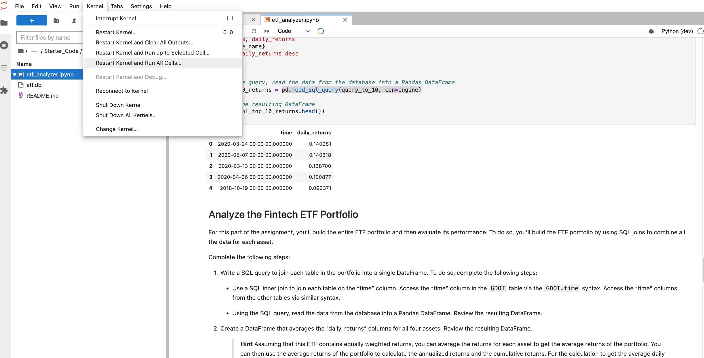

# ETF ANALYZER APP 

## Table of Contents

 1. Project Motivation
 2. About the Application
 3. Techologies Used
 4. File Descriptions
 5. How to Run
 6. License
 

----------------------------

##  Project Motivation

This project is in completion of the Columbia University FinTech 2022 bootcamp module seven weekly challenge exercise.


## About the Application

This application analyzes etf stocks in a porfolio, using pandas and sql. It show trends on changes in the portfolio's daily returns, and calculate the cumulative return of every stock in the porfolio.


## Technologies Used

The application is written in python programming langauge. Users need a device that can run python3 applications. Other python applications, libraries and frameworks used in this project include:

1. jupyterlab 
See requirements.txt for list of all libaries used.

## File Descriptions

1. analyzing_etf_porfolio.png

2. requirements.txt

3. etf_analyzer.ipynb

4. README.md

-----------------

## How to Run

1. Clone this repo https://github.com/ruejo2013/fintech7.git

2. Navigate to the folder

```
  conda create -n <evn_name> python=3.7 
  conda activate <evn_name>
  git clone <link to repo>
  pip install -r requirements.txt 

```
 
 
3. Open the etf_analyzer.ipynb on jupyterlab in the conda env just activated.



This will run the notebook, generate some charts, and statistical analysis for the etf portfolio.

## License
This project is in completion of the Columbia University FinTech 2022 bootcamp module seven weekly challenge exercise. It should not be copied and used for commercial purpose without the authorization of the admin of this repo. For futher information please contact Patrick via email on pruejoma@gmail.com